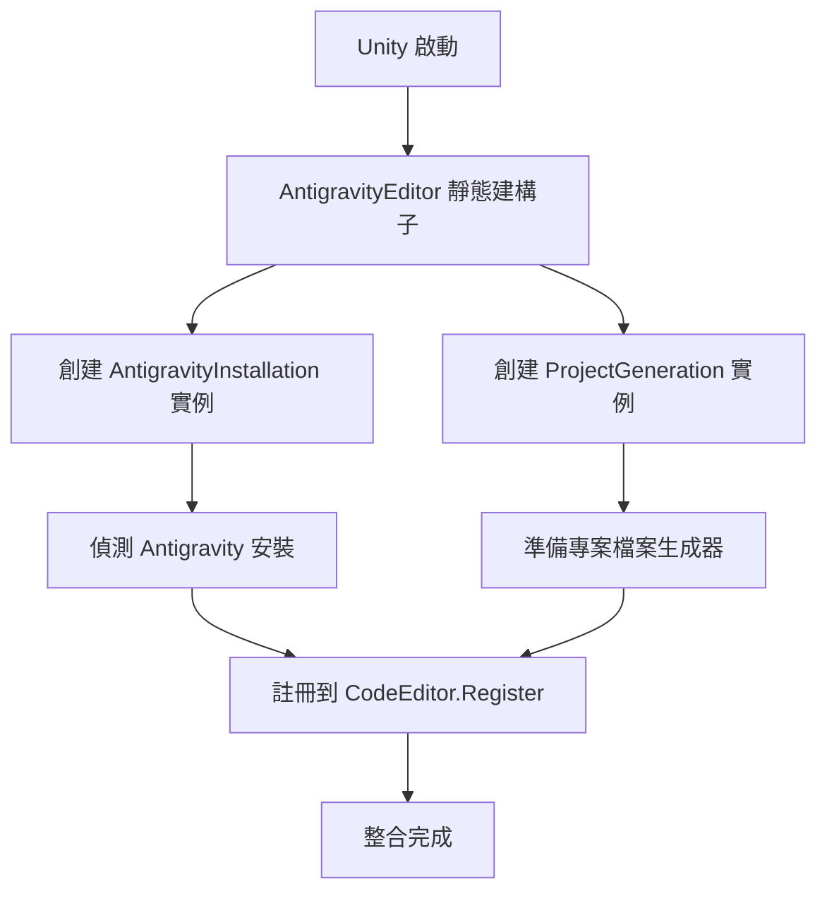
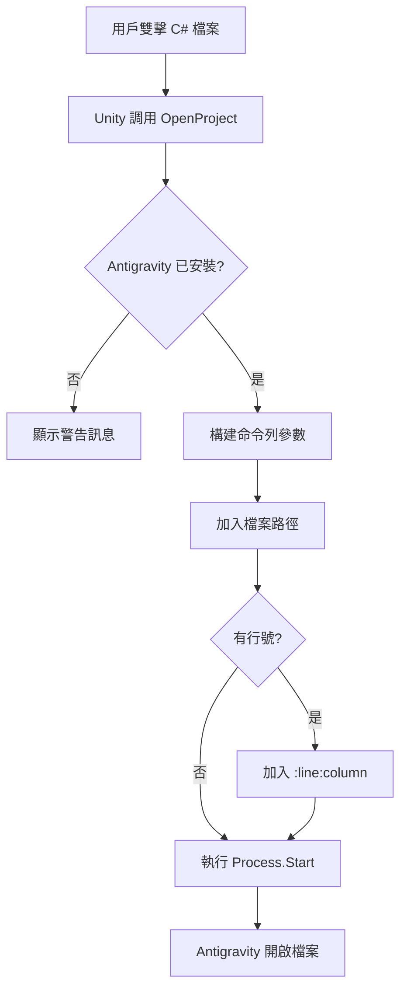
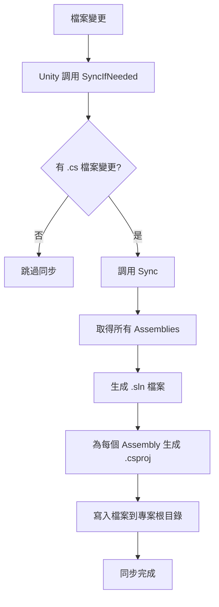

# Antigravity Unity Integration - 開發者文件

## 概述

這個套件允許您在 Unity 專案中使用 Antigravity 作為外部程式碼編輯器。它提供了完整的整合，包括自動發現安裝、專案檔案生成以及無縫的檔案開啟功能。

## 架構設計

### 核心組件

#### 1. **AntigravityEditor.cs**
主要的整合類別，實現 `IExternalCodeEditor` 介面。

**職責：**
- 註冊 Antigravity 作為 Unity 的外部編輯器選項
- 處理檔案開啟請求
- 管理專案檔案同步
- 提供 UI 設定介面

**關鍵方法：**
```csharp
public bool OpenProject(string filePath = "", int line = -1, int column = -1)
public void SyncAll()
public void SyncIfNeeded(string[] addedFiles, ...)
```

#### 2. **AntigravityInstallation.cs**
負責偵測 Antigravity 的安裝位置。

**跨平台支援：**
- **Windows**: 檢查 `%LOCALAPPDATA%`, `Program Files` 等
- **macOS**: 檢查 `/Applications` 和用戶 Applications 目錄
- **Linux**: 檢查 `/usr/bin`, `/usr/local/bin`, `~/.local/bin`

**使用方式：**
```csharp
string path = AntigravityInstallation.GetAntigravityPath();
bool installed = AntigravityInstallation.IsAntigravityInstalled();
```

#### 3. **ProjectGeneration.cs**
生成 Visual Studio 相容的專案檔案。

**生成檔案：**
- `.sln` (Solution file)
- `.csproj` (Project files for each assembly)

**IntelliSense 支援：**
- 包含所有 C# 原始檔案
- 包含所有 Unity API 參考
- 包含專案間依賴關係

### 檔案結構

```
com.kazky.ide.antigravity/
├── package.json              # UPM 套件清單
├── README.md                 # 使用者文件
├── CHANGELOG.md              # 版本變更記錄
├── LICENSE.md                # MIT 授權條款
├── DEVELOPMENT.md            # 開發者文件（本檔案）
└── Editor/                   # 編輯器腳本
    ├── com.kazky.ide.antigravity.asmdef
    ├── AntigravityEditor.cs
    ├── AntigravityInstallation.cs
    ├── IDiscovery.cs
    ├── IGenerator.cs
    └── ProjectGeneration/
        └── ProjectGeneration.cs
```

## 工作流程

### 1. 初始化流程



### 2. 檔案開啟流程



### 3. 專案同步流程



## 如何擴展

### 添加新的安裝路徑

在 `AntigravityInstallation.cs` 中修改對應平台的方法：

```csharp
private static CodeEditor.Installation[] GetWindowsInstallations()
{
    var possiblePaths = new[]
    {
        // 現有路徑...
        "您的新路徑",
    };
    // ...
}
```

### 自訂專案檔案生成

在 `ProjectGeneration.cs` 中修改 `GenerateProjectContent` 方法：

```csharp
private string GenerateProjectContent(Assembly assembly)
{
    var content = "<?xml version=\"1.0\" encoding=\"utf-8\"?>\n";
    // 添加您的自訂設定...
    return content;
}
```

### 添加 UI 設定選項

在 `AntigravityEditor.cs` 的 `OnGUI` 方法中添加：

```csharp
public void OnGUI()
{
    // 現有 UI...
    
    // 添加新設定
    EditorGUILayout.LabelField("您的新設定", EditorStyles.boldLabel);
    // 添加控制項...
}
```

## 測試

### 手動測試步驟

1. **安裝測試**
   - 在 Unity 專案中安裝此套件
   - 檢查 Edit → Preferences → External Tools
   - 確認 "Antigravity" 出現在編輯器選項中

2. **檔案開啟測試**
   - 選擇 Antigravity 作為外部編輯器
   - 雙擊任何 C# 檔案
   - 確認 Antigravity 正確開啟並跳轉到正確位置

3. **專案同步測試**
   - 創建新的 C# 腳本
   - 檢查專案根目錄是否生成了 .sln 和 .csproj 檔案
   - 確認 IntelliSense 正常工作

### 除錯技巧

啟用詳細日誌：

```csharp
// 在 AntigravityEditor.cs 中添加
UnityEngine.Debug.Log($"Opening file: {filePath} at line {line}");
```

檢查生成的專案檔案：

```bash
# 在專案根目錄
cat YourProjectName.sln
cat Assembly-CSharp.csproj
```

## 常見問題

### Q: Antigravity 未被偵測到
**A**: 檢查以下項目：
1. Antigravity 是否正確安裝
2. 安裝路徑是否在 `AntigravityInstallation.cs` 的搜尋清單中
3. 查看 Unity Console 的警告訊息

### Q: IntelliSense 不工作
**A**: 
1. 點擊 "Regenerate Project Files" 按鈕
2. 檢查 .csproj 檔案是否包含所有 C# 檔案
3. 確認 Antigravity 支援 C# IntelliSense

### Q: 雙擊檔案沒有反應
**A**:
1. 確認已選擇 Antigravity 作為外部編輯器
2. 檢查 Unity Console 的錯誤訊息
3. 手動測試 Antigravity 啟動指令

## 未來開發方向

### 短期目標
- [ ] 支援更多 Antigravity 安裝路徑
- [ ] 添加自訂安裝路徑選項
- [ ] 改進專案檔案生成效能
- [ ] 添加單元測試

### 中期目標
- [ ] 實現 Unity ↔ Antigravity 雙向通訊
- [ ] 即時錯誤同步
- [ ] 支援 Antigravity 特定功能（AI 建議等）

### 長期目標
- [ ] Unity Editor 內嵌 Antigravity 面板
- [ ] 深度整合 Unity API 自動完成
- [ ] 智慧腳本範本生成
- [ ] 除錯器整合

## 貢獻指南

歡迎貢獻！請參考以下流程：

1. Fork 此倉庫
2. 創建功能分支 (`git checkout -b feature/AmazingFeature`)
3. 提交變更 (`git commit -m 'Add some AmazingFeature'`)
4. 推送到分支 (`git push origin feature/AmazingFeature`)
5. 開啟 Pull Request

### 程式碼風格

- 使用 C# 標準命名規範
- 添加 XML 文件註解
- 保持方法簡潔（<50 行）
- 添加適當的錯誤處理

## 授權

MIT License - 詳見 [LICENSE.md](LICENSE.md)

## 聯絡方式

如有問題或建議，請開啟 GitHub Issue。
